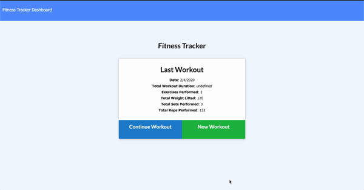

# FitnessTracker
What Gets Measured Gets Managed.

## Summary 
For individuals waanting to track their fitness, Fitness Tracker allows them to create and track daily workouts so they can easily reference what they have done and stay on top of their weekly workouts. Users will be able to make multiple exercises in a workout on a given day as well as be able to track the name, type, weight, sets, reps, and duration of their exercises. If the exercise is a cardio exercise, Fitness tracker will be able to track a users distance traveled. The applicaiton uses mongoDB in order to keep track of user exercises and mongoose to get and post user exercise information between the cleint side and the data base side.


## Demo
 

 
## Technologies Used
- MongoDB: Used as a templating engine for ul HTML snippets that hold the task cards, and separate the generation of the different HTML from the rest of the JavaScript for cleaner and more organozed code.
- Morgan: Request logger middleware for Node. js that simplifies the process of logging requests to the applicaiton application.
- Express.js - Used for application set up of middle ware for end point connection between the front end and backend.
- Node.js - Used for package managment and to execute JavaScript code to build the command line tool for server-side scripting.
- jQuery - Used for executing functions on the browser side that allow the application render user inputs.
- Git - Version control system to track changes to source code.
- GitHub - Hosts repository that can be deployed to GitHub Pages.
 
## Code Snippet
The following JavaScript snippet is the PUT route on our server side Javascript file. This snippet of code is repsonsible for sending the ddWorkout json data back to the client side Javascript where it will then be rendered on the page. What makes this particualr peice of code interesting is that we are aassociating our db.Exercise with our dbWorkout, which are two seperate modles. We can do this by requiring mongoose and referencing the our exercise id in the workout shcema.


```js

app.put("/api/workouts/:id", (req, res) => {
  console.log(req.body);
  db.Exercise.create(req.body)
      .then((data) => db.Workout.findOneAndUpdate(
          {_id: req.params.id},
          { 
              $push: {
                  exercises: data._id 
              }, 
              $inc: {
                  totalDuration: data.duration
              } 
          },
          { new: true })
      )
      .then(dbWorkout => {
      res.json(dbWorkout);
      }).catch(err => {
          res.json(err);
      });
});
```

## Built With
* [MongoDB](https://www.mongodb.com/)
* [Morgan](https://www.npmjs.com/package/morgan)
* [Express.js](https://expressjs.com/)
* [Node.js](https://nodejs.org/en/)
* [npmjs](https://docs.npmjs.com/)
* [inquirer](https://www.npmjs.com/package/inquirer)

## Authors

**Chris Melby**
- [LinkedIn](https://www.linkedin.com/in/chris-melby-71106b126/)
- [Link to Github](https://github.com/cmelby)
- [Portfolio](https://cmelby.github.io/portfolio/)
